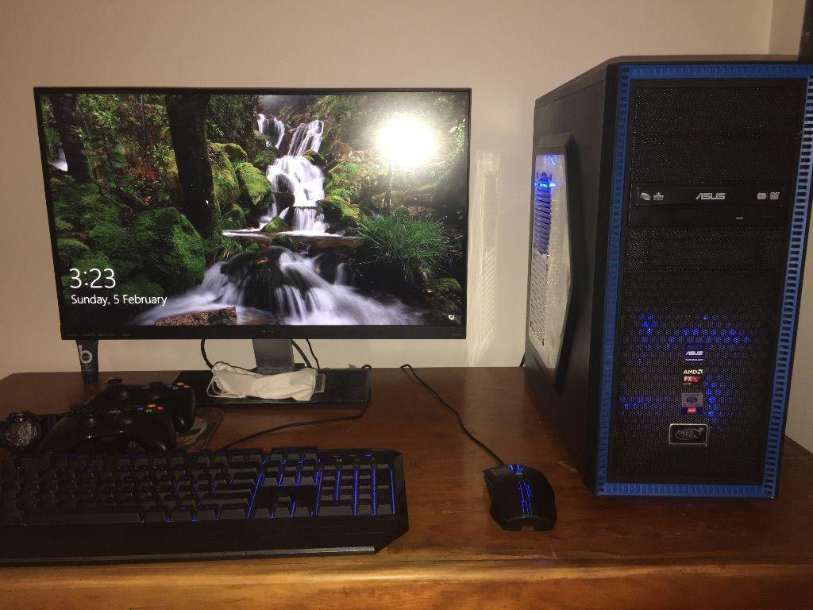
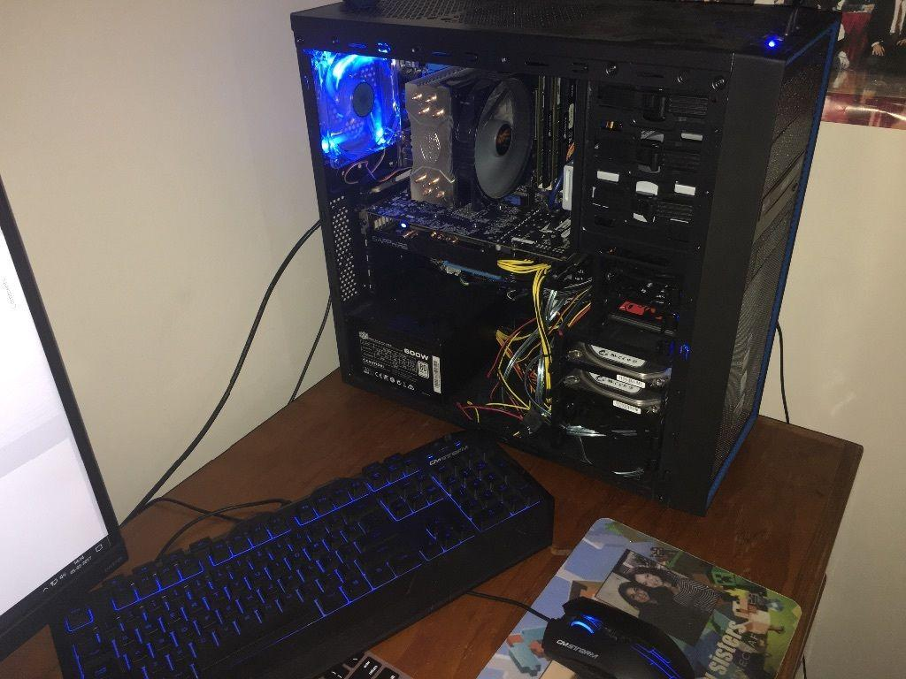
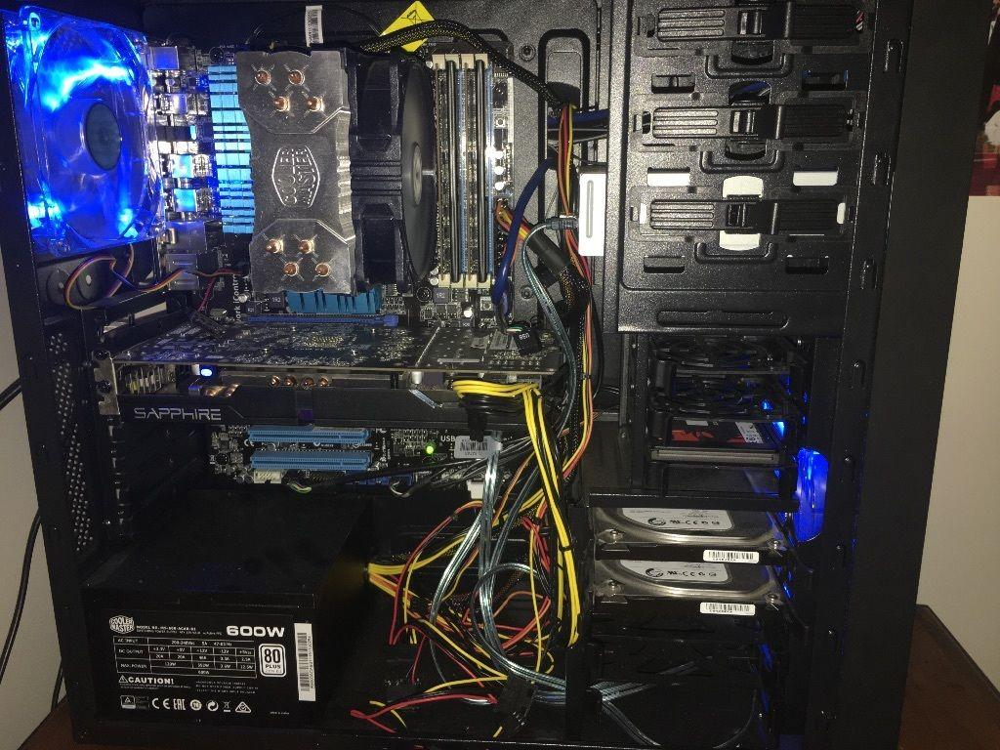

# Hardware-pc-Knowledge
AMD GAMING PC COMPLETE BUILD 2015 - https://au.pcpartpicker.com/b/yNGG3C

##### This setup was build in November 2015, It's just less than an year and a half old. It can run almost all modern day games. ##### This setup is still worth around $1200 AUD!
##### The monitor in the listed PART list is not what i have, Wasn't listed in pcpartpicker so the monitor i am using is BenQ EW2750 27'' which is about the same price as the one listed.

##### Hardware Specs are Listed below :-
##### OPERATING SYSTEM : Windows 10 home
##### CPU : AMD FX 8350 Octa Core Processor 4.0 - 4.2 GHz Turbo
##### GPU : Saphire R9 380 OC 2GB
##### MOTHER BOARD : ASUS M5A97 R2.0
##### RAM : 12GB RAM (2x 4 GB DDR3 & 2x 2DDR2)
##### HARDDISK : 1TB (2x 500GB Seagate HDD)
##### SSD : 120GB (Kingston)
##### CPU COOLER : Cooler Master 212x Custom Fan
##### TOWER CASE : Deep Cool Tesseract Blue Tower W/ 2 LED blue Fans
##### POWER BOX : 600W Cooler Master
##### USB 3.0 yes
##### ADDITIONAL : ASUS DVD RW

##### GAMES WITH SPECS TESTED:
##### GTA V b/w MediumHigh, The Witcher 3 - High, Fallout 4- medium-high, Rocket League-full high, MGSV Phantom Pain-MediumHigh, DOOM4-high, BF4-Ultra, All were running Smoothly. Really had a good time.

##### There is a youtube video of a similar computer made with exactly same specs by a popular youtuber. WATCH : https://www.youtube.com/watch?v=820aYiavGYk
